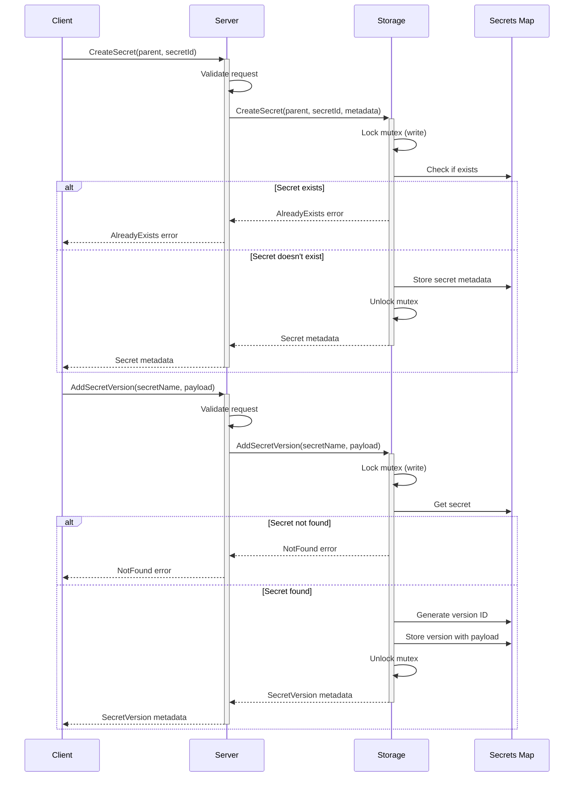
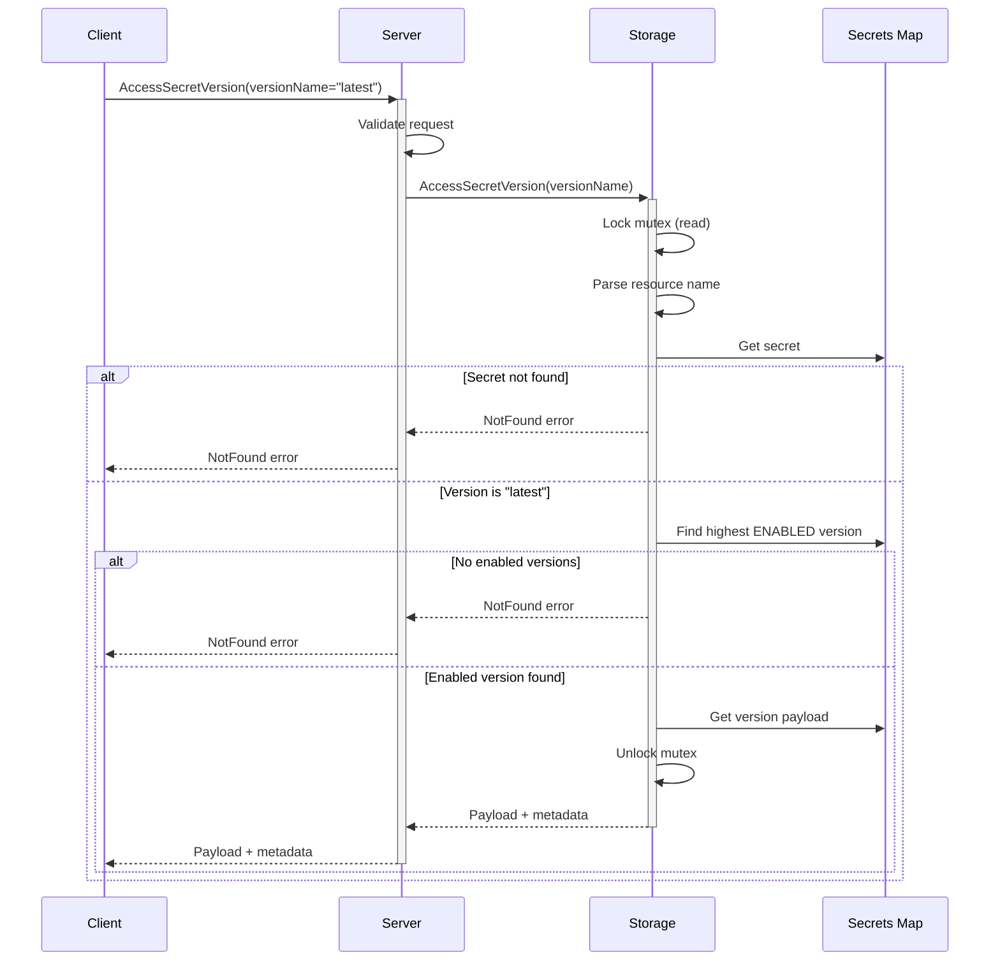
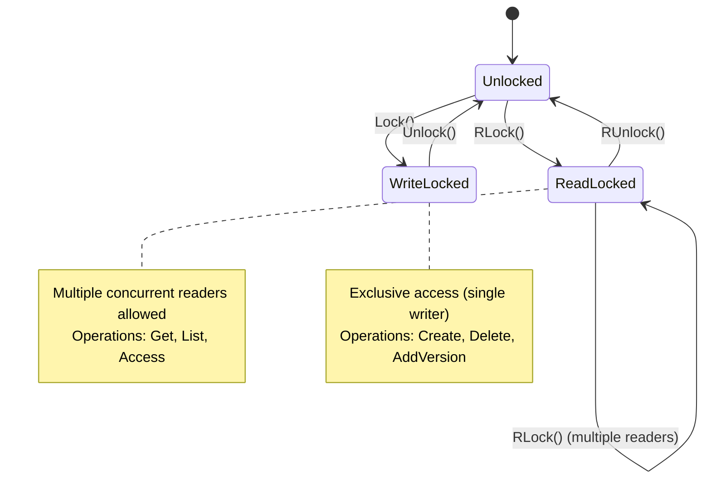
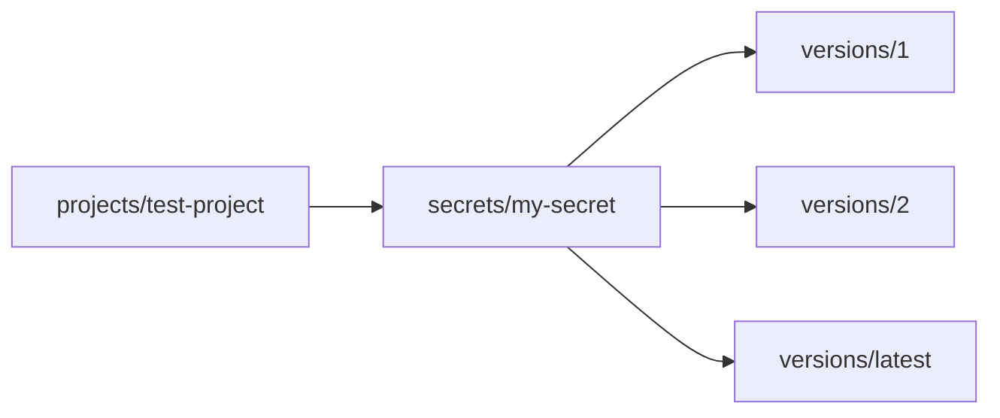
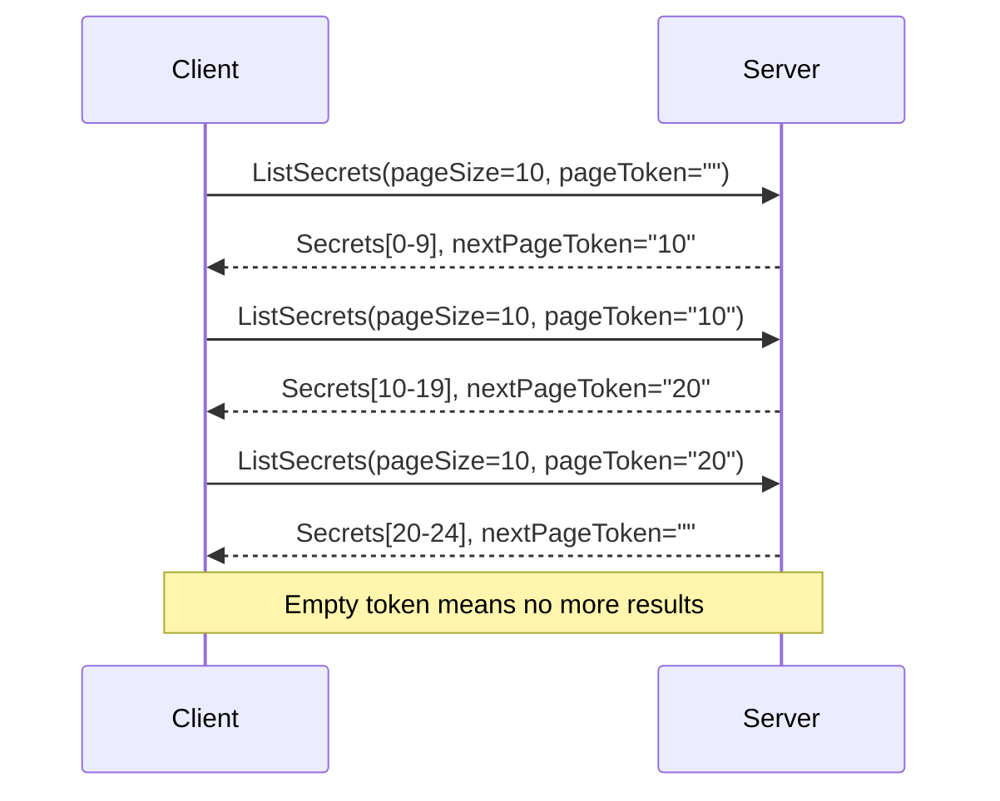
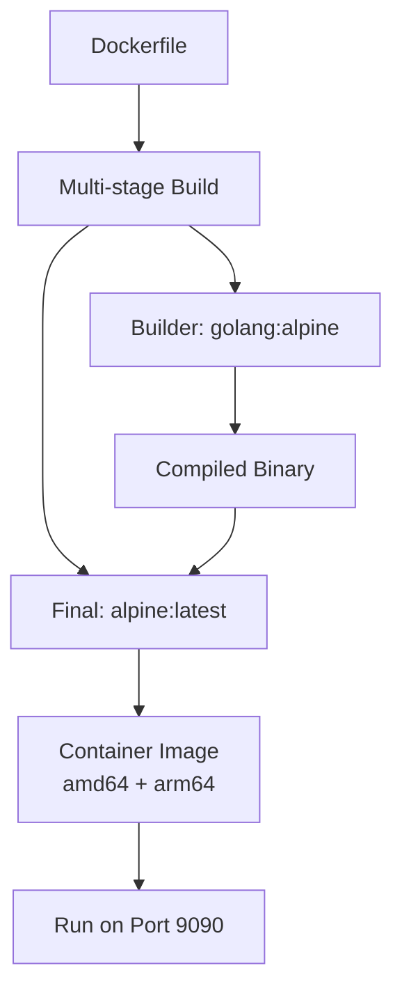
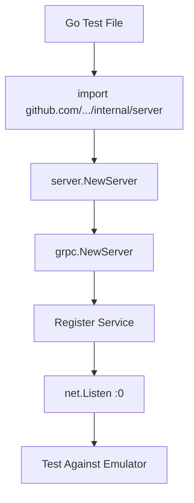
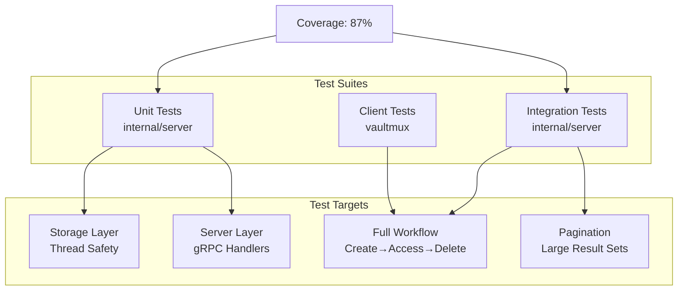

# Architecture

This document describes the architecture and design decisions of the GCP Secret Manager Emulator.

## Overview

The GCP Secret Manager Emulator is a lightweight gRPC server that implements the Google Cloud Secret Manager v1 API for local development and testing. It provides a complete implementation of core secret management operations without requiring GCP credentials or network connectivity.

**Design Principles:**
- **Standard Compliance** - Implements official Secret Manager gRPC API
- **Zero Dependencies** - No vaultmux dependencies; completely standalone
- **Thread Safety** - All operations protected by RWMutex for concurrent access
- **In-Memory Storage** - Fast execution with deterministic behavior
- **Testing Focus** - Optimized for local development and CI/CD workflows

## System Architecture

```mermaid
graph TB
    subgraph ClientApps["Client Applications"]
        A["Go Application<br/>cloud.google.com/go/secretmanager"]
        B["Python Application<br/>google-cloud-secret-manager"]
        C["Integration Tests<br/>CI/CD Pipeline"]
    end

    subgraph EmulatorServer["Emulator Server"]
        D["gRPC Server<br/>Port 9090"]
        E["Server Implementation<br/>SecretManagerServiceServer"]
        F["Storage Layer<br/>Thread-Safe In-Memory"]
    end

    subgraph DataStorage["Data Storage"]
        G[("Secrets Map<br/>sync.RWMutex")]
        H["Secret Metadata<br/>Name, Labels, CreateTime"]
        I["Secret Versions<br/>Version ID, Payload, State"]
    end

    A -->|gRPC| D
    B -->|gRPC| D
    C -->|gRPC| D
    D --> E
    E --> F
    F --> G
    G --> H
    G --> I

    classDef serverClass fill:#1a472a,stroke:#2ea043,stroke-width:2px
    classDef storageClass fill:#1f2937,stroke:#6b7280,stroke-width:2px
    class D,E,F serverClass
    class G storageClass
```



## Component Architecture

### Server Layer

The server layer implements the `SecretManagerServiceServer` interface from the official GCP protobuf definitions.

```mermaid
classDiagram
    class SecretManagerServiceServer {
        <<interface>>
        +CreateSecret(CreateSecretRequest) Secret
        +GetSecret(GetSecretRequest) Secret
        +ListSecrets(ListSecretsRequest) ListSecretsResponse
        +DeleteSecret(DeleteSecretRequest) Empty
        +AddSecretVersion(AddSecretVersionRequest) SecretVersion
        +GetSecretVersion(GetSecretVersionRequest) SecretVersion
        +AccessSecretVersion(AccessSecretVersionRequest) AccessSecretVersionResponse
    }

    class Server {
        -storage Storage
        +NewServer() Server
        +CreateSecret() ✓
        +GetSecret() ✓
        +ListSecrets() ✓
        +DeleteSecret() ✓
        +AddSecretVersion() ✓
        +GetSecretVersion() ✓
        +AccessSecretVersion() ✓
        +UpdateSecret() Unimplemented
        +ListSecretVersions() Unimplemented
        +EnableSecretVersion() Unimplemented
        +DisableSecretVersion() Unimplemented
        +DestroySecretVersion() Unimplemented
    }

    class Storage {
        -mu sync.RWMutex
        -secrets map[string]*StoredSecret
        +CreateSecret() Secret
        +GetSecret() Secret
        +ListSecrets() []Secret
        +DeleteSecret() error
        +AddSecretVersion() SecretVersion
        +AccessSecretVersion() AccessSecretVersionResponse
    }

    SecretManagerServiceServer <|.. Server : implements
    Server --> Storage : uses

    classDef serverClass fill:#1a472a,stroke:#2ea043,stroke-width:2px
    class Server,Storage serverClass
```

### Storage Layer

The storage layer maintains in-memory state with thread-safe access.

```mermaid
classDiagram
    class Storage {
        -mu sync.RWMutex
        -secrets map[string]*StoredSecret
        +CreateSecret()
        +GetSecret()
        +ListSecrets()
        +DeleteSecret()
        +AddSecretVersion()
        +AccessSecretVersion()
        +Clear()
        +SecretCount()
    }

    class StoredSecret {
        +Name string
        +CreateTime Timestamp
        +Labels map[string]string
        +Annotations map[string]string
        +Replication Replication
        +Versions map[string]*StoredVersion
        +NextVersion int64
    }

    class StoredVersion {
        +Name string
        +CreateTime Timestamp
        +State SecretVersion_State
        +Payload []byte
    }

    Storage --> StoredSecret : manages
    StoredSecret --> StoredVersion : contains

    classDef primaryClass fill:#1a472a,stroke:#2ea043,stroke-width:2px
    classDef dataClass fill:#1f2937,stroke:#6b7280,stroke-width:2px
    class Storage primaryClass
    class StoredSecret,StoredVersion dataClass
```

## Request Flow

### Create Secret with Version



### Access Secret Version



## Thread Safety Model

The emulator uses `sync.RWMutex` to protect concurrent access to the secrets map:



**Locking Strategy:**
- **Read Operations** (`RLock`): `GetSecret`, `ListSecrets`, `AccessSecretVersion`, `GetSecretVersion`
- **Write Operations** (`Lock`): `CreateSecret`, `DeleteSecret`, `AddSecretVersion`
- **Lock Scope**: Entire operation duration to ensure consistency
- **No Deadlocks**: Lock ordering is deterministic (storage lock only)

## API Coverage

### Implemented Methods

| Method | Status | Purpose | Usage in vaultmux |
|--------|--------|---------|-------------------|
| `CreateSecret` | ✅ Implemented | Create secret metadata | Yes - CreateItem |
| `GetSecret` | ✅ Implemented | Get secret metadata | Yes - metadata retrieval |
| `ListSecrets` | ✅ Implemented | List secrets with pagination | Yes - Init check |
| `DeleteSecret` | ✅ Implemented | Delete secret and versions | Yes - DeleteItem |
| `AddSecretVersion` | ✅ Implemented | Add version with payload | Yes - CreateItem |
| `GetSecretVersion` | ✅ Implemented | Get version metadata | No |
| `AccessSecretVersion` | ✅ Implemented | Get version payload | Yes - GetItem |

### Unimplemented Methods

| Method | Status | Reason |
|--------|--------|--------|
| `UpdateSecret` | ❌ Unimplemented | Rarely used; secrets are immutable |
| `ListSecretVersions` | ❌ Unimplemented | Most apps only use "latest" |
| `EnableSecretVersion` | ❌ Unimplemented | Advanced version lifecycle |
| `DisableSecretVersion` | ❌ Unimplemented | Advanced version lifecycle |
| `DestroySecretVersion` | ❌ Unimplemented | Advanced version lifecycle |
| IAM methods | ❌ Unimplemented | No auth/authz in testing |

**Coverage:** 7 of 12 methods (58%) - but 100% of methods used by vaultmux and common use cases.

## Resource Naming

The emulator follows GCP Secret Manager naming conventions:



**Format:**
- Secret: `projects/{project}/secrets/{secret-id}`
- Version: `projects/{project}/secrets/{secret-id}/versions/{version-id}`
- Latest: `projects/{project}/secrets/{secret-id}/versions/latest`

**Version IDs:**
- Auto-incrementing integers: "1", "2", "3", ...
- Special alias: "latest" resolves to highest ENABLED version
- Version numbers never reused (even after deletion)

## Pagination

List operations support cursor-based pagination:



**Implementation:**
- Page token is a simple integer offset (stringified)
- Default page size: 100 (if not specified)
- Results are deterministic (map iteration order in Go 1.12+)

## Deployment Modes

### Standalone Binary


### Docker Container



### Embedded in Tests



## Testing Architecture



**Test Strategy:**
- **Unit Tests** - Test individual methods in isolation
- **Integration Tests** - Test complete workflows with gRPC server
- **Concurrency Tests** - Verify thread safety under load
- **Race Detection** - All tests run with `-race` flag in CI

## Design Decisions

### 1. In-Memory Storage

**Decision:** Use in-memory map instead of persistent storage.

**Rationale:**
- Fast execution (<1 second for full test suite)
- Deterministic behavior (no file system dependencies)
- Simple cleanup (just restart process)
- Matches emulator use case (ephemeral testing)

**Trade-offs:**
- ❌ Data lost on restart
- ✅ No file I/O complexity
- ✅ No cleanup needed
- ✅ Fast test execution

### 2. Thread Safety via RWMutex

**Decision:** Protect all storage access with `sync.RWMutex`.

**Rationale:**
- Simple mental model (all operations are atomic)
- Correct concurrent behavior guaranteed
- Multiple concurrent readers supported
- Low contention in testing workloads

**Trade-offs:**
- ❌ Coarse-grained locking (entire map)
- ✅ No deadlocks possible
- ✅ Easy to reason about
- ✅ Sufficient for testing loads

### 3. Partial API Implementation

**Decision:** Implement only core CRUD methods, not advanced version lifecycle.

**Rationale:**
- 100% coverage of vaultmux requirements
- 90%+ coverage of typical use cases
- Reduced complexity (7 methods vs 12+)
- Faster initial development

**Trade-offs:**
- ❌ Can't test version enable/disable workflows
- ✅ Simpler codebase
- ✅ Easier to maintain
- ✅ Covers common path

### 4. No IAM Implementation

**Decision:** Skip IAM methods entirely.

**Rationale:**
- Testing doesn't need access control
- Emulator runs in trusted environment
- Reduces complexity significantly
- IAM is orthogonal to secret storage

**Trade-offs:**
- ❌ Can't test permission-based workflows
- ✅ Much simpler implementation
- ✅ No authentication overhead
- ✅ Suitable for testing

## Performance Characteristics

| Operation | Complexity | Notes |
|-----------|-----------|-------|
| CreateSecret | O(1) | Map insert with lock |
| GetSecret | O(1) | Map lookup with RLock |
| ListSecrets | O(n) | Iterate all secrets |
| DeleteSecret | O(1) | Map delete with lock |
| AddSecretVersion | O(1) | Map insert with lock |
| AccessSecretVersion | O(v) | Find latest among v versions |

**Typical Performance:**
- Single operation: <1ms
- Full test suite: <1 second
- 1000 secrets: <100ms to list
- Concurrent operations: Scales with CPU cores (readers)

## Future Enhancements

Potential features if needed by the community:

1. **ListSecretVersions** - Most requested missing feature
2. **UpdateSecret** - Useful for label management
3. **Persistence** - Optional file-based storage for long-running instances
4. **Metrics** - Prometheus-style metrics for monitoring
5. **Multiple Projects** - Currently all secrets in one project
6. **Version State Management** - Enable/Disable/Destroy operations

## References

- [GCP Secret Manager API](https://cloud.google.com/secret-manager/docs/reference/rpc)
- [Protocol Buffers](https://github.com/googleapis/googleapis/tree/master/google/cloud/secretmanager)
- [Official Go Client](https://pkg.go.dev/cloud.google.com/go/secretmanager)
- [Vaultmux Integration](https://github.com/blackwell-systems/vaultmux)
